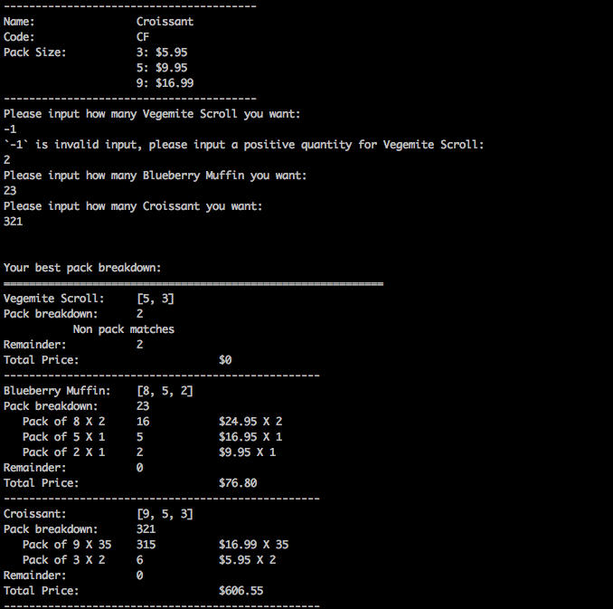

# Bakery Pack Breakdown

## Requirement Specification
This system will breakdown the packs of client's order by following rules:

1. If perfect breakdown exists, always return the perfect breakdown with minimum packs amount. Perfect breakdown means match the client's quantity demand with no remainder.

2. If perfect breakdown not exists, consider to minimise the remainder first, then the packs amount.
    
    Example: Having pack size 5 and 8, for quantity 11 the expected answer should be 2 packs of 5 instead of 1 pack of 8 due to previous one have the lower remainder.
    
3. In special case, it may have multiple solutions with same minimum pack amount. We consider they are both best solutions and not compare other factors anymore (price etc.)
    
    For example use `[8,5,2]` to break down 15, both `8x1 + 5x1 + 2x1` and `5x3` can match. 
     
## Install Environment
To make it convenient to run and test, this works is finished within Python built-in library, no extra packages needed.

The Python version should be 3.6 or above due to used [f-string formatting](https://docs.python.org/3/reference/lexical_analysis.html#f-strings) which is new in Python 3.6.
- Python 3.6 or above
- Git

## How to configure (optional)

Two settings provided, set environment variable to change default setting:

1. **DEBUG**: for enabling debug log, accept `true`, `false`, `1` and `0`, default is False
2. **PRICE_DECIMAL_PLACES**: to specify price decimal places, accept integer number, default is `2`

## How to install and run
Clone this repo using git then run `main.py`.

 ```
 git clone https://github.com/lorne-luo/rubix-bakery.git
 cd rubix-bakery
 python main.py
 ```
 **Screenshot:**
 
 
 
## How to test
Simply run `test.py`
```
 cd rubix-bakery
 python test.py
 ```
In this part, I did [**super strong random testing**](https://github.com/lorne-luo/rubix-bakery/blob/master/test.py#L42) to cover the kernal algorithm function [`PackBreaker.pack_breakdown()`](https://github.com/lorne-luo/rubix-bakery/blob/master/helper.py#L31). 

See [test.py](https://github.com/lorne-luo/rubix-bakery/blob/master/test.py#L42)

## Algorithm Explaination
### Problem Definition

Problem input: `TOTAL_QUANTITY` (int) and `PACK_SIZES` (int list)

Problem output: 

1. If perfect match exist, find a `PACK_AMOUNTS` let `PACK_AMOUNTS * PACK_SIZES == TOTAL_QUANTITY` and `MINIMISE(SUM(PACK_AMOUNTS))`.

2. If perfect match no exist, find a `PACK_AMOUNTS` meet `MINIMISE(TOTAL_QUANTITY - PACK_AMOUNTS * PACK_SIZES)` first, then `MINIMISE(SUM(PACK_AMOUNTS))`.

### Problem Analysis

Follow the considerations below, we can always find a global best solution for this problem:


For problem inputs `TOTAL_QUANTITY` and `PACK_SIZES`, **always have a divides satisfy**:
```
    # PERFECT_PACKED_QUANTITY could be 0 if PERFECT_PACKED_QUANTITY < MIN(PACK_SIZES)
    # REST_QUANTITY could be 0 then TOTAL_QUANTITY could be perfectly matched 
    TOTAL_QUANTITY = PERFECT_PACKED_QUANTITY + REST_QUANTITY  
    
    # example: [8, 5, 2] = [8] + [5, 2], then MAX_PACK_SIZE = 8, REST_SIZE_LIST = [5, 2]
    PACK_SIZES = [MAX_PACK_SIZE] + REST_SIZE_LIST 
```

Considering function `BEST_BREAKDOWN`, it can be solved **optimally by breaking it into two sub-problems**:
```
    BEST_BREAKDOWN(TOTAL_QUANTITY, PACK_SIZES) = BEST_BREAKDOWN(PERFECT_PACKED_QUANTITY, PACK_SIZES]) + 
                                                 BEST_BREAKDOWN(REST_QUANTITY, PACK_SIZES])
```

To minimize the total pack amount, we just need **priorly use `MAX_PACK_SIZE` to fill the `PERFECT_PACKED_QUANTITY`** as possible as could be, so the formula evolves to below one **without changing the problem's solution space**. 
```
    BEST_BREAKDOWN(TOTAL_QUANTITY, PACK_SIZES) = BEST_BREAKDOWN(PERFECT_PACKED_QUANTITY, [MAX_PACK_SIZE]]) +
                                                 BEST_BREAKDOWN(REST_QUANTITY, REST_SIZE_LIST])
```

For meet this problem's requirement, I have below thought:
1. Loop the formula above **with descending `PERFECT_PACKED_QUANTITY`** can make sure always first test the solutions with minimum packs amount.
2. To make sure priorly return the perfect matched solution, just need check remainder in each loop, **if remainder == 0 return current solution immediately**.
3. For the case of a perfect match not exist, a global variable defined out of the loop is needed to **keep the first occurred solution with the lowest remainder**. If loop ended still can't find a perfect match solution, then give this global variable as the return.

### Algorithm Implementation
As this problem have :
1. Entire problem can split into overlapping sub-problems (recursive calling of function `BEST_BREAKDOWN`)
2. Sub-problem's result maybe part of of final solution, so it should be memorized and reused in other recursion (see `filled_pack_amount` parameter in [PackBreaker.pack_breakdown()](https://github.com/lorne-luo/rubix-bakery/blob/master/helper.py#L30))

So this is a typical dynamic programming problem. The implementation of core functions is in [helper.py](https://github.com/lorne-luo/rubix-bakery/blob/master/helper.py).

1. In [PackBreaker.pack_breakdown()](https://github.com/lorne-luo/rubix-bakery/blob/master/helper.py#L30), it will **loop all possible solution by the order of total pack amount ascending**. 
This will make sure it can minimise the total packs amount.

2. During the recursion two global variables `PackBreaker.best_remainder` and `PackBreaker.best_remainder_packs` will always keep dated best solution.

3. Once `PackBreaker.best_remainder == 0` means a perfect match solution found, then will **return empty array to pop out the calling stack ASAP**. 
This will keep it will always have best performance.

4. If perfect matched solution not exist, these global variables will still keep the dated best solution, so after whole solution space searched, it **still can return the best solution with remainder**.

## Development & Tools

1. This project followed TDD development process, test case had been added in the [first commit](https://github.com/lorne-luo/rubix-bakery/commit/63badd3b8767b34ee9204c31cccb988f09be6feb).

2. Implemented by Mac OS and PyCharm

3. All codes are formatted using [black](https://github.com/python/black) to improve the readability. 
